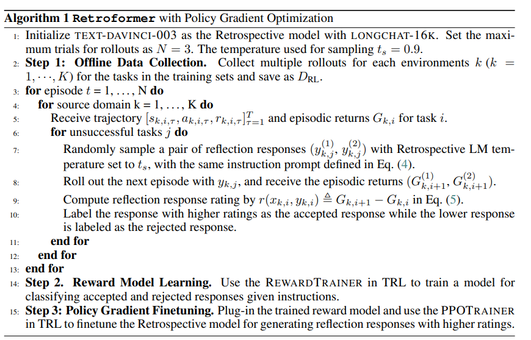
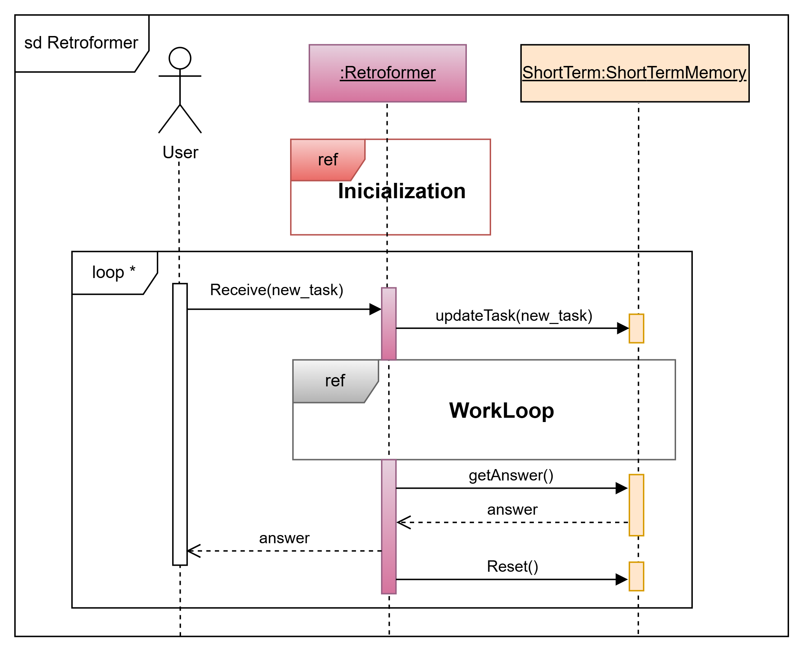

# Appendix

## Reflexion

### Architecture Description using `FALAA`
The following sections present the information retrieval and prompt creation fragments of the `Planner` and `Reflector` components of the `Reflexion` agent in Figures 1 and 2, respectively.

#### Figure 1
UML sequence diagram of the information retrieval process for `Planner` to generate a prompt. In this flow, `Planner` uses internal actions of type `retrieval`, represented by the *get* methods of the `episodic`, `procedural`, and `semantic` memories, from which examples are obtained along with the allowed actions and instructions. These are condensed into the *PlannerPrompt* object, aiming to guide the behavior of the `Planner` LLM to generate actions.

#### Figure 2
UML sequence diagram of the information retrieval process for `Reflector` to generate a prompt. In this flow, `Reflector` uses internal actions of type `retrieval`, represented by the *get* methods of the `episodic` and `procedural` memories, from which examples for the LLM and the allowed actions along with the instructions to guide the LLM behavior are obtained. These, together with the task and current trajectory retrieved from the `short-term memory`, are used to generate the prompt.

---

## Retroformer

### Pseudo Code
Figure 1 shows the training process based on RLHF, which was ultimately used as a guide to decide whether `Retroformer` would be trained for one or multiple environments.

#### Figure 1
Diagram outlining the RLHF-based training process, consisting of three steps: Obtaining training data; Training a reward model with Supervised Learning; and fine-tuning the *retrospective model* through response ranking using PPO.

---

### Architecture Description using `FALAA`

#### (1) Conceptual Description Level
Figure 2 shows the UML class diagram of a `Retroformer` agent.

#### Figure 2
UML class diagram of a `Retroformer` agent.

---

### Components Description
`Retroformer` originally proposes three fundamental components: an *Actor*, a *Retrospective model*, and a memory module (short-term and long-term memory, as well as a *replay buffer*). Along with these components, a reward model is trained and used. Each component is presented below, providing the original definition and its respective standardized adaptation:

1. **Actor**
   - **Original Definition**: The **Actor** is described, like in `Reflexion`, as the component responsible for solving the assigned task, using an LLM to generate and execute actions in an environment.
   - **Adaptation in `FALAA`**:
     - Defined as an additional component, consisting of two main subcomponents: the `Planner`, which is responsible for planning actions, and the `Executor`, which executes them.
     - The original concept of “solving the task” is maintained but adapted to fit within the `FALAA` structure for better integration and compatibility with other agents.

2. **Retrospective Model**
   - **Original Definition**: It consists of a smaller LLM compared to the *Actor* and is responsible for producing reflections (*feedback*) when the *Actor* fails in the task.
   - **Adaptation in `FALAA`**:
     - Associated with the `Reflector` component, whose function is to generate reflections and insights on failures or possible improvements in the `Actor`'s strategy.

3. **Reward Model**
   - **Original Definition**: Specifically trained by `Retroformer` to evaluate the quality of reflections generated by the *Retrospective model*.
   - **Adaptation in `FALAA`**:
     - Designated as an independent object within the architecture, similar to LLMs, dedicated to evaluation and reward assignment.

4. **Memory Module**
   - **Original Definition**:
     - **Short-term memory**: Stores the trajectory (actions, observations, rewards) generated by the *Actor*.
     - **Long-term memory**: Saves reflections produced by the *Retrospective model*.
     - **Replay buffer**: Specialized memory for storing triplets of prompts, reflections, and the accumulated reward of the episode.
   - **Adaptation in `FALAA`**:
     - `Short-term memory`: Under the standard structure, it stores a series of attributes, including the trajectory generated by the `Actor` and the accumulated rewards of that trajectory, as well as attributes aimed at the training process of `Retroformer`.
     - `Long-term memory for reflections`: Reflections are stored in the `semantic memory` due to its nature of storing knowledge.
     - `Replay buffer`: Established as a dictionary that stores a triplet of prompts, reflections, and their classification as correct or incorrect for various environments. Stored in the `episodic memory` due to its nature of storing past experiences.

---

`Retroformer` utilizes all structures proposed by `FALAA`, with the `procedural memory` playing a key role due to the architecture's training processes. This memory in the `Retroformer` architecture can execute *learning actions* through methods that implicitly update stored information, modifying the LLM and neural network-based reward model policies.

The training process also influences the `short-term memory`, which stores various information such as *train_data*. The trajectory stored in the `short-term memory` also undergoes modifications, adopting a sequence that now includes the elements `Action`, `Observation`, and `Reward`, reflecting the new architectural needs for a more structured and efficient process.

---

We define several Objects representing prompts and examples used in the creation of actions and reflections by `Planner` and `Reflector`, respectively. This is to make their composition explicit, as in implementations they are often text strings or token lists.

The `Evaluator` component plays a crucial role within the architecture. Since it is responsible for generating evaluations and thus rewards, it integrates the reward model dedicated to evaluating the quality of reflections. `Evaluator` offers various functional methods, including:
- The evaluation of an action-observation pair through a reward function.
- Calculating the sum of rewards in a given trajectory.
- Determining whether an action corresponds to a final response.
- Assessing the quality of a reflection.

In general, the architecture of `Retroformer` partially retains the structure of `Reflexion`, but introduces modifications and new functionalities, such as the use of rewards for each step of the trajectory or new attributes in the `short-term memory` used in the training processes of the reward model and retrospective model.

**Behavior Description:**  
Figure 1 shows the main UML sequence diagram of a `Retroformer` agent. Before interacting with the user, `Retroformer` exists in a certain environment, so its memories must be initialized (this fragment is identical to `Reflexion` in Figure 2). Once initialized, an infinite loop begins where the agent receives a new task from the user, which is added to the `short-term memory` before proceeding with the work cycle (condensed under the *ref* fragment referencing Figure 3). After completing this process, the generated response is retrieved from the `short-term memory` and returned to the user. Similar to `Reflexion`, it is not explicitly described what should happen if the response is not found, so we assume that the agent does not perform any additional actions. Finally, the `short-term memory` is cleared using its `Reset()` method, leaving the agent ready to receive a new task.

---

### Work Cycle of the Retroformer Agent

Regarding the referenced work cycle (see Figure 2), it is observed that the `Retroformer` agent maintains a work cycle similar to that of `Reflexion`, consisting of a loop running from 1 to the maximum value *episode_limit*, which indicates the number of failed responses allowed before ending the cycle. The loop continues as long as the response generated in the previous iteration is not correct. In each iteration, the `Actor` attempts to solve the task (see Figure 3), returning the sum of the accumulated rewards in its trajectory along with an indication of whether the task was successfully resolved. If the task is not successfully resolved, the process of generating reflections is executed, introducing a new flow (see Figure 4). Finally, a new iteration begins.

---

### Task Resolution Process of the Actor Component

The task resolution process of the `Actor`, as shown in Figure 3, remains as general as possible, since `Retroformer` allows replacing the `Actor` with components from other agents. The task resolution flow is based on two parts:

1. **Part One**: A loop with a maximum of *step_limit* steps, where in each step, `Planner` is asked to generate an action (the planning and corresponding information retrieval process for prompt creation is the same as in `Reflexion`, see Figures 5 and 6, respectively). The generated action is then evaluated to determine if it is the final response, which would end the loop. If not, `Executor` executes the action, receiving an observation that is added to the trajectory in the `short-term memory` (the process is the same as in `Reflexion`, see Figure 7). Then, the action-observation pair is evaluated using the reward function of `Evaluator`, returning a score for this step, which is converted into a *Reward* object and added to the `short-term memory`.

2. **Part Two**: Occurs when the loop ends, either by reaching the step limit or by finding the correct response. The current episode is then evaluated, where the accumulated rewards from the current trajectory are obtained, and it is determined whether the response is correct or not, returning these two values.

---

### Reflection Process of the Reflector Component

The process of selecting the best reflection from the `Reflector` component of a `Retroformer` agent, shown in Figure 1, is the main innovation of this architecture. It illustrates how `Reflector` generates `reflection_tries` reflections in a loop. In each step of this loop:
1. A reflection is generated using the `reflect()` method (see Figure 2). 
2. A prompt composed of information from short-term and long-term memories (see Figure 3) is used to generate a reflection, which is then returned.

Once the reflection is generated, it is evaluated using the `Evaluator` component, which acts as an intermediary. Using the prompt and the generated reflection, `Evaluator` applies its pre-trained neural network model to assess the quality of the reflection. If the reflection is better than the best one stored so far, it is saved as the best reflection in the `short-term memory`. At the end of the cycle, the best reflection is stored in the `semantic memory`, ensuring that the storage limit is not exceeded.

---

### Best Reflection Selection Process

---

### Information Retrieval Process for Reflection

In this flow, `Reflector` uses internal `retrieval` actions, represented by the *get* methods of the `episodic` and `procedural` memories, from which examples for the LLM and the allowed actions along with instructions to guide the LLM's behavior are obtained. These, together with the current task and trajectory retrieved from the `short-term memory`, are used to generate the prompt. This prompt, before being returned, is stored in the `short-term memory`.

---

### Training Process of the Retroformer Agent

**Training Process:**  
`Retroformer` employs an RLHF-based training method, where it trains a neural network model using supervised learning to evaluate reflections, along with the supervised learning-based training of the LLM contained in `Reflector`. The training process consists of the three RLHF steps:
1. **Data Collection**: Figure 4 illustrates this step.
2. **Training a Reward Model**: Figure 5 illustrates this step.
3. **Fine-Tuning the Reflector**: Figure 6 illustrates this step.

---

### Data Collection Process

To avoid human intervention in labeling good and bad reflections, the difference between the accumulated rewards of two successive episodes is used as a signal to classify reflections into good and bad categories.

---

### Parallel Reflection and Replay Buffer Storage

---

### Reward Model Training Process

---

### Reflector Fine-Tuning Process

---

### Reflector Fine-Tuning Using PPO Algorithm

